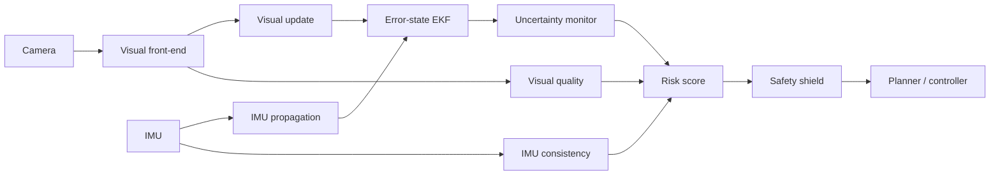
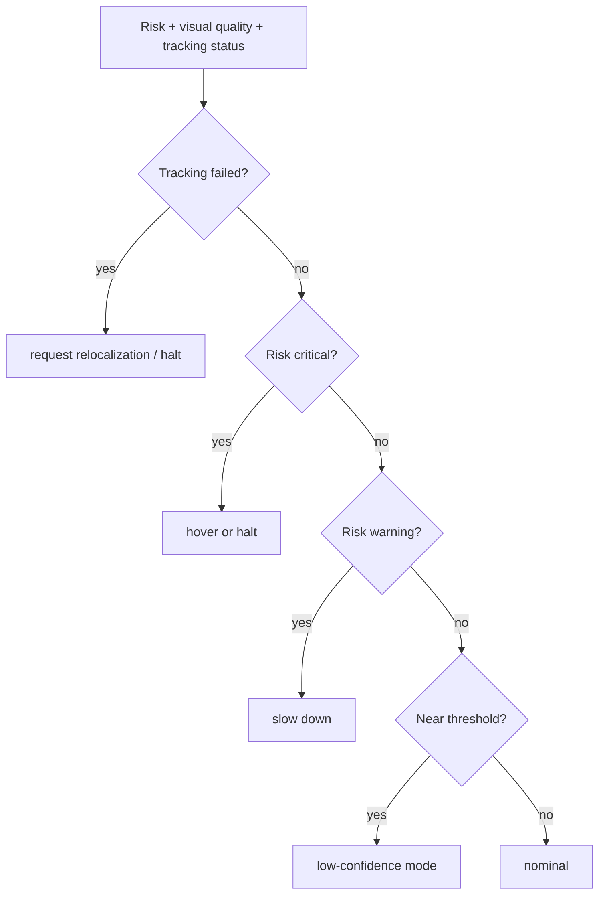

# SHIELD-VIO: Safety-Aware Visual-Inertial Odometry

[](https://github.com/panagiotagrosdouli/SHIELD-VIO/actions)


**SHIELD-VIO studies how a Visual-Inertial Odometry system can detect unreliable state estimates and shield downstream navigation from unsafe perception failures.**

> Research question: **How can a VIO system detect when its state estimate becomes unreliable and shield downstream navigation from unsafe perception failures?**

This repository is intentionally conservative: it does **not** claim state-of-the-art performance, does **not** invent benchmark numbers, and separates implemented code, prototypes, and planned work.

<p align="center"></p>

## Motivation

Accurate pose estimation alone is not enough for safe autonomy. A downstream planner can behave unsafely when it receives a confident-looking but degraded VIO pose. SHIELD-VIO adds introspection: visual tracking quality, IMU consistency, covariance health, innovation consistency, normalized risk, and a safety shield that can request low-confidence mode, slow-down, hover/halt, or relocalization.

## Scientific formulation

The nominal IMU-centric state is

```math
x = \{p_{WI}, v_{WI}, q_{WI}, b_a, b_g\}
```

with error state

```math
\delta x = [\delta p, \delta v, \delta\theta, \delta b_a, \delta b_g]^T \in \mathbb{R}^{15}.
```

The scaffold propagates state and covariance with IMU measurements, applies linear visual measurement updates, computes `NEES`, `NIS`, covariance trace/log-det/conditioning, visual quality, risk, and shield decisions. See [`docs/MATHEMATICAL_FORMULATION.md`](docs/MATHEMATICAL_FORMULATION.md).

## Architecture



## Safety shield



## Installation

```bash
git clone https://github.com/panagiotagrosdouli/SHIELD-VIO.git
cd SHIELD-VIO
python -m venv .venv
source .venv/bin/activate
python -m pip install -e '.[dev]'
pytest -q
```

## Quick start

```bash
python scripts/run_synthetic_experiment.py --scenario nominal --seed 7 --out results/synthetic/nominal
python scripts/run_synthetic_experiment.py --scenario motion_blur --seed 11 --out results/synthetic/motion_blur
python scripts/make_demo_gif.py
```

Synthetic outputs are demos and sanity checks, **not** benchmark evidence.

## Dataset examples

Real dataset integration is documented/scaffolded but not benchmarked yet.

```bash
# EuRoC placeholder run until the real loader is implemented
python scripts/run_synthetic_experiment.py --scenario nominal --out results/euroc_placeholder

# TUM-VI placeholder run until the real loader is implemented
python scripts/run_synthetic_experiment.py --scenario aggressive_motion --out results/tumvi_placeholder

# ROS2 planned/prototype
ros2 launch shield_vio_ros2 shield_monitor.launch.py
```

Datasets are not redistributed. See [`docs/DATASETS.md`](docs/DATASETS.md).

## Implemented / Prototype / Planned

| Area | Status | Evidence |
|---|---:|---|
| Quaternion utilities and PSD covariance checks | Implemented | `shield_vio/core/math.py`, tests |
| Error-state EKF propagation/update scaffold | Implemented | `shield_vio/estimation/eskf.py`, tests |
| IMU noise model and consistency checks | Implemented | `shield_vio/imu/model.py` |
| Visual quality score | Implemented | `shield_vio/frontend/features.py` |
| Covariance, NEES, NIS, risk normalization | Implemented | `shield_vio/uncertainty/metrics.py` |
| Safety shield fallback policy | Implemented | `shield_vio/safety/shield.py` |
| ATE/RPE/failure-detection metrics | Implemented | `shield_vio/evaluation/metrics.py` |
| Synthetic degradation experiments | Prototype | `scripts/run_synthetic_experiment.py` |
| GIF/video export | Prototype | `scripts/make_demo_gif.py` |
| EuRoC, TUM-VI, KITTI benchmarks | Planned | `docs/DATASETS.md`, `docs/EVALUATION_PROTOCOL.md` |
| ROS2 node/RViz | Prototype/Planned | `shield_vio/ros2/README.md` |
| Next.js website | Planned scaffold | `website/README.md` |

## Metrics

ATE, RPE, NEES, NIS, covariance trace, log determinant, condition number, failure-detection precision/recall, false alarm rate, time-to-detection, tracking failure rate, shield activation rate, and runtime FPS.

## Baselines

Planned baselines: standard VIO without shield, fixed uncertainty threshold, visual-quality monitor, SHIELD-VIO uncertainty-aware monitor, and oracle degradation label scaffold. Results are **Pending** until run reproducibly.

## Limitations

This is not a production VIO backend. The current estimator is a research scaffold; real EuRoC/TUM-VI/KITTI numbers, hardware validation, ROS2 deployment, and closed-loop navigation experiments are pending.

## Citation

```bibtex
@misc{grosdouli2026shieldvio,
  title  = {SHIELD-VIO: Safety-Aware Visual-Inertial Odometry with Uncertainty Monitoring and Failure Shielding},
  author = {Grosdouli, Panagiota},
  year   = {2026},
  note   = {Research prototype; no state-of-the-art claim},
  url    = {https://github.com/panagiotagrosdouli/SHIELD-VIO}
}
```

## Future MSc/PhD extensions

Conformal failure prediction, uncertainty calibration, shield-aware MPC, active perception recovery, ROS2/hardware validation, and time-to-detection evaluation under safety-critical navigation constraints.
