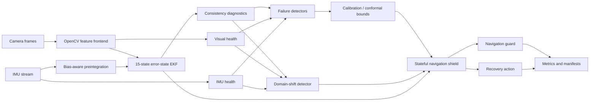

# SHIELD-VIO

<p align="center">
  <strong>Estimator introspection, calibrated failure prediction, and protective navigation for visual–inertial autonomy</strong>
</p>

<p align="center">
  A reproducible research framework for detecting when visual–inertial state estimation is becoming unreliable,<br/>
  quantifying that risk, and protecting downstream navigation before localization failure becomes safety critical.
</p>

<p align="center">
  <a href="https://github.com/panagiotagrosdouli/SHIELD-VIO/actions"></a>
  
  
  
  
  
</p>

<p align="center">
  <strong>English</strong> · <a href="README_GR.md">Ελληνικά</a>
</p>

<p align="center">
  
</p>

> **Research question**  
> Can a visual–inertial estimator recognize loss of reliability early enough to protect downstream navigation, trigger recovery, and preserve meaningful confidence under degradation and domain shift?

## Why SHIELD-VIO?

Visual–inertial odometry is usually evaluated through trajectory accuracy. For safety-oriented autonomy, accuracy alone is insufficient. A navigation system must also determine:

- whether its state estimate is still trustworthy;
- whether covariance and innovation statistics remain consistent;
- whether the current sensor stream differs from the calibration domain;
- whether a localization failure is becoming likely;
- how much warning time is available;
- and which protective or recovery action should follow.

SHIELD-VIO treats estimator health as a first-class output. Visual quality, IMU health, innovations, covariance, consistency diagnostics, failure scores, calibrated probabilities, conformal bounds, domain-shift states, shield actions, and recovery requests remain explicit and auditable.

<p align="center">
  
</p>

## Research contributions

SHIELD-VIO is organized around five connected contributions.

| Contribution | Purpose | Current evidence |
|---|---|---|
| **Inspectable VIO health signals** | Preserve visual, inertial, innovation, covariance, and consistency diagnostics instead of exposing only pose | Unit and synthetic validation |
| **Failure-aware estimation** | Convert heterogeneous diagnostics into interpretable and learned risk estimates | Experimental baselines |
| **Calibration and shift awareness** | Separate raw scores, calibrated probabilities, conformal bounds, and distribution-shift states | Numerical and controlled-array validation |
| **Closed-loop protection** | Map persistent risk into warning, slowdown, hold, relocalization, halt, and emergency actions | Closed-loop policy tests |
| **Reproducible evidence pipeline** | Generate deterministic runs, metrics, figures, manifests, and multi-seed summaries | CI-backed synthetic evidence |

The project does **not** claim that these contributions establish production readiness or formal safety. They define an inspectable experimental platform for studying when localization should no longer be trusted.

## At a glance

| Layer | Current capability | Evidence level |
|---|---|---|
| Visual frontend | Shi–Tomasi + pyramidal Lucas–Kanade tracking | Research prototype |
| Inertial backend | Bias-aware IMU preintegration | Analytical unit validation |
| Estimation | 15-state error-state EKF | Numerical invariant validation |
| Failure prediction | Rules, logistic baseline, calibration metrics, conformal bounds | Experimental |
| Shift awareness | Rolling four-state domain-shift detector | Experimental |
| Navigation protection | Stateful shield, speed limiting, hold, halt, relocalization request | Closed-loop unit validation |
| Evaluation | Seeded degradations, failure labels, multi-seed statistics | Synthetic validation |
| Public datasets | EuRoC, TUM-VI, generic adapters | Pending dataset execution |
| ROS 2 / hardware | Planned | Validation required |

## Research architecture



The feature frontend, preintegration module, and ESKF are research components rather than a production-quality end-to-end VIO replacement.

## Scientific formulation

The nominal IMU-centric state is

```math
x = \{p_{WI}, v_{WI}, q_{WI}, b_a, b_g\},
```

with a 15-dimensional local error state

```math
\delta x = [\delta p, \delta v, \delta \theta, \delta b_a, \delta b_g]^T.
```

For innovation `ν` and innovation covariance `S`, consistency is monitored through

```math
\mathrm{NIS} = \nu^T S^{-1}\nu.
```

When ground truth is available, state consistency can be studied through

```math
\mathrm{NEES} = e^T P^{-1}e.
```

NIS, NEES, covariance growth, visual quality, failure scores, calibrated probabilities, and conformal bounds are kept as distinct quantities. An uncalibrated diagnostic score is never treated as a probability.

## Implemented research components

### Visual feature tracking

The OpenCV frontend provides:

- Shi–Tomasi corner detection;
- pyramidal Lucas–Kanade optical flow;
- persistent track identifiers;
- forward–backward rejection;
- feature replenishment and exclusion masks;
- track age, survival, outlier ratio, blur, brightness, and feature-count diagnostics.

<p align="center"></p>

### IMU preintegration and ESKF

The inertial and filtering modules include:

- delta position, velocity, and rotation;
- covariance propagation and first-order bias Jacobians;
- accelerometer and gyroscope bias handling;
- 15-state error propagation;
- Joseph-form visual updates;
- quaternion normalization;
- covariance symmetry and positive-semidefinite repair;
- external-pose reset for recovery studies.

<p align="center"></p>

### Controlled degradation

Visual degradations include darkness, overexposure, additive noise, contrast reduction, feature dropout, occlusion, and frame dropout. IMU degradations include noise, bias drift, scale-factor error, saturation, axis failure, and packet loss.

Each transformation is deterministic under a fixed seed and emits explicit metadata. Injected degradation is not automatically treated as estimator failure.

### Failure prediction, calibration, and shift awareness

The repository includes:

- transparent multi-signal rules;
- a dependency-light logistic detector;
- Brier score and negative log likelihood;
- expected and maximum calibration error;
- split-conformal scalar risk bounds;
- rolling `IN_DISTRIBUTION`, `POSSIBLE_SHIFT`, `CONFIRMED_SHIFT`, and `SEVERE_SHIFT` states.

<p align="center"></p>
<p align="center"></p>

### Closed-loop shielding and recovery

The stateful shield supports:

`NORMAL → WARNING → SLOW_DOWN → HOLD_POSITION → RELOCALIZE_REQUESTED → HALT → EMERGENCY_STOP`

It includes hysteresis, minimum dwell behavior, stale-sensor handling, emergency override, speed scaling, and recovery-action selection.

<p align="center"></p>
<p align="center"></p>

## What happens in one experiment?

A typical synthetic experiment follows this sequence:

1. generate a deterministic trajectory and sensor stream;
2. inject a configured visual, inertial, or combined degradation;
3. propagate and update the estimator;
4. record uncertainty, innovations, visual quality, and health signals;
5. produce a failure-risk score and calibration outputs;
6. update the domain-shift state;
7. execute the shield policy;
8. write trajectories, diagnostics, events, metrics, figures, and provenance metadata.

This separation allows the estimator, detector, calibration layer, shift monitor, and shield policy to be evaluated independently.

## Executable evidence

The panels below come from a deterministic synthetic CI run and are kept separate from explanatory graphics.

<p align="center"> </p>

These figures are **synthetic validation only**. They do not imply public-dataset, ROS 2, simulator, hardware, production-VIO, calibrated real-world, or formal-safety validation.

## Installation

Requirements:

- Python 3.10 or newer;
- NumPy, Matplotlib, PyYAML, Pillow, and OpenCV;
- optional development tools supplied by the `dev` extra.

```bash
git clone https://github.com/panagiotagrosdouli/SHIELD-VIO.git
cd SHIELD-VIO
python -m venv .venv
source .venv/bin/activate
python -m pip install --upgrade pip
python -m pip install -e '.[dev]'
```

Windows PowerShell activation:

```powershell
.venv\Scripts\Activate.ps1
python -m pip install -e ".[dev]"
```

## Reproduce the validated synthetic pipeline

Run the complete workflow:

```bash
python scripts/run_all.py
```

Run static checks and tests:

```bash
ruff check shield_vio scripts tests
black --check .
pytest -q
```

Generate evidence panels from executable artifacts:

```bash
python scripts/run_synthetic_demo.py --out results/synthetic_demo --seed 7
python scripts/generate_readme_evidence.py \
  --results results/synthetic_demo \
  --output assets/readme/evidence
```

Run repeated scenarios:

```bash
python scripts/run_scenario_suite.py --num-seeds 20 --output results/scenario_suite
```

Docker:

```bash
docker build -t shield-vio .
docker run --rm -v "$(pwd)/results:/app/results" shield-vio python scripts/run_all.py
```

Docker reproduces the software pipeline. It does not imply GPU, ROS 2, public-dataset, simulator, or hardware validation.

## Repository map

```text
shield_vio/
├── core/                 typed states and measurements
├── features/             visual tracking and quality diagnostics
├── preintegration/       bias-aware IMU preintegration
├── estimation/           estimator interfaces and ESKF
├── consistency/          NIS, NEES, and consistency checks
├── uncertainty/          covariance and uncertainty summaries
├── failure_detection/    rule, logistic, and conformal methods
├── calibration_metrics/  probability-calibration metrics
├── domain_shift/         rolling shift-state detection
├── shield/               stateful protective policy
├── navigation/           downstream command guarding
├── recovery/             recovery actions and selection
├── datasets/             EuRoC, TUM-VI, and generic adapters
├── simulation/           scenarios and degradation injection
└── evaluation/           labels, metrics, and aggregate statistics

scripts/                  experiment, evaluation, evidence, and media runners
tests/                    numerical, policy, and pipeline validation
docs/                     failure definitions, status, visuals, and provenance
assets/readme/             explanatory diagrams and pinned evidence
```

## Generated outputs

Depending on the executed workflow, generated artifacts can include:

```text
results/synthetic_demo/ground_truth.csv
results/synthetic_demo/estimated_trajectory.csv
results/synthetic_demo/uncertainty.csv
results/synthetic_demo/visual_quality.csv
results/synthetic_demo/risk_score.csv
results/synthetic_demo/shield_events.csv
results/metrics/summary.json
results/metrics/metrics.csv
results/figures/*
results/scenario_suite/suite_summary.json
```

Every reported result should preserve its seed, configuration, command, Git revision, dependency versions, metrics, and artifact paths.

## Evaluation protocol

A rigorous experiment should keep training, calibration, test, and shifted-test sequences separate. Detector comparisons should use identical seeds, degradation conditions, and failure definitions.

| Question | Suggested evidence |
|---|---|
| Does the estimator remain accurate? | ATE, RPE, final error, attitude or velocity error |
| Is uncertainty statistically meaningful? | NIS, NEES, covariance health |
| Does the detector identify failures? | Precision, recall, F1, AUROC, AUPRC |
| Are predicted risks reliable? | Brier score, NLL, ECE, reliability diagrams |
| Is warning early enough? | Detection lead time and time-to-failure |
| Does the shield improve outcomes? | Unsafe actions avoided, mission completion, recovery success |
| Does the method generalize? | Held-out strengths, degradation families, and shifted distributions |
| Is execution practical? | Runtime, latency, memory, and compute cost |

Failure labels must be derived from observable estimator or navigation behavior. Oracle degradation metadata must remain separate from deployable detector inputs.

## Research hypotheses

The framework is designed to test—not assume—the following hypotheses:

- **H1:** consistency and health diagnostics detect degradation earlier than trajectory-error thresholds alone;
- **H2:** multi-signal detectors outperform any single diagnostic source;
- **H3:** calibrated failure probabilities lead to more reliable shield decisions than raw scores;
- **H4:** explicit domain-shift detection reduces overconfidence under unseen degradation;
- **H5:** shielding reduces unsafe downstream actions under degraded localization;
- **H6:** recovery-aware protection improves mission outcomes compared with halt-only policies.

Confirmation requires controlled multi-seed experiments and public-dataset evaluation with appropriate train, calibration, and test separation.

## Public-dataset adapters

Local-layout adapters exist for EuRoC MAV, TUM-VI, and generic timestamped camera/IMU folders. They are currently validated with mocked filesystem fixtures. No public-sequence metric is claimed until actual dataset execution is completed.

## Research roadmap

<p align="center"></p>

1. Connect feature observations and preintegrated IMU increments into a complete executable ESKF sequence.
2. Run calibrated detector comparisons on identical seeds.
3. Execute EuRoC and TUM-VI sequences.
4. Add reliability, lead-time, ablation, and sensitivity studies.
5. Add stronger estimator, detector, and shielding baselines.
6. Strengthen relocalization, recovery, and active-perception actions.
7. Add ROS 2 bag replay and simulator validation.
8. Profile timing, memory, and compute requirements.
9. Proceed to hardware only after dataset and simulation evidence are stable.

## Limitations and claim boundary

- The integrated production-quality VIO backend is not complete.
- The frontend, preintegration, and ESKF are research prototypes.
- Real public-dataset execution remains pending.
- The logistic detector has not been benchmarked on real failure data.
- Conformal coverage depends on calibration assumptions and may fail under severe non-exchangeable shift.
- Robust relocalization, map management, loop closure, active perception, ROS 2, simulator, and hardware execution remain incomplete.
- The navigation shield is supervisory research logic, not a formally verified controller.
- No production, hardware-safety, state-of-the-art, or formal-guarantee claim is made.

SHIELD-VIO must not be used as a standalone safety mechanism on a physical platform without independent validation, platform-specific hazard analysis, fault containment, and an appropriate supervisory controller.

## Contributing

High-value contributions include:

- numerical validation of preintegration and ESKF Jacobians;
- reproducible EuRoC and TUM-VI execution;
- calibrated and conformal failure prediction;
- domain-shift and out-of-distribution evaluation;
- warning lead-time and detector ablations;
- recovery-aware navigation and active perception;
- ROS 2 integration and runtime profiling.

Contributions should include focused tests, deterministic seeds where applicable, explicit units and coordinate frames, reproducible commands, and an honest statement of the validation level.

## Citation

```bibtex
@misc{grosdouli2026shieldvio,
  title  = {SHIELD-VIO: Estimator Introspection, Calibrated Failure Prediction, and Protective Navigation for Visual--Inertial Autonomy},
  author = {Grosdouli, Panagiota},
  year   = {2026},
  note   = {Open-source research prototype; synthetic validation and public-dataset adapters},
  url    = {https://github.com/panagiotagrosdouli/SHIELD-VIO}
}
```

## License

Released under the MIT License.
