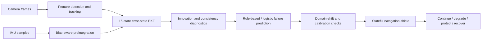

<div align="center">

# SHIELD-VIO

## Failure-Aware Visual–Inertial Odometry with Runtime Protection

A reproducible research framework for detecting visual–inertial degradation before localization failure becomes safety-critical, then applying stateful supervisory responses.

[](#installation)
[](#verified-scope)
[](#reproducibility)

**English** · [Ελληνικά](README_GR.md)

</div>

> **Research question:** Can a visual–inertial estimator identify loss of reliability early enough to protect a navigation stack before estimator divergence becomes operationally critical?

SHIELD-VIO combines visual feature tracking, bias-aware IMU preintegration, error-state filtering, consistency diagnostics, failure prediction, domain-shift monitoring, and a stateful navigation shield. The project is designed as an inspectable experimental platform rather than a black-box autonomy claim.

## Why this project matters

Visual–inertial odometry can degrade abruptly under motion blur, low texture, occlusion, illumination change, inertial bias, vibration, timing mismatch, or distribution shift. A navigation system that reports only a pose estimate may continue operating after its uncertainty model has stopped reflecting reality.

SHIELD-VIO studies a different operating principle:

1. estimate motion;
2. measure estimator consistency and degradation signals;
3. predict elevated failure risk;
4. enter a protected navigation state;
5. expose the evidence that triggered the transition.

The goal is not to claim formally verified safety. The goal is to make failure awareness measurable, reproducible, and testable.

## System overview



## Implemented components

| Component | Current role |
|---|---|
| Shi–Tomasi feature detection | Selects trackable visual features |
| Lucas–Kanade optical flow | Tracks features between frames |
| Bias-aware IMU preintegration | Aggregates inertial motion between updates |
| 15-state error-state EKF | Maintains the navigation error state |
| NIS and NEES diagnostics | Evaluates innovation and state consistency |
| Deterministic degradation injection | Produces controlled visual and inertial failures |
| Rule-based failure detector | Provides an interpretable baseline |
| Logistic failure detector | Provides a learned probabilistic baseline |
| Calibration and conformal evaluation | Studies reliability of risk estimates |
| Stateful navigation shield | Applies supervisory operating-state transitions |

## Failure-awareness pipeline

SHIELD-VIO separates estimation from protection so each layer can be evaluated independently.

### 1. State estimation

The visual and inertial streams produce a navigation estimate through feature tracking, IMU preintegration, and error-state filtering.

### 2. Consistency monitoring

Innovation statistics and state-error diagnostics are used to identify when residual behavior is incompatible with the estimator's uncertainty assumptions.

### 3. Failure prediction

Interpretable rules and a logistic model convert diagnostic features into a failure-risk signal. The learned detector is treated as a research baseline, not as proof of safety.

### 4. Supervisory protection

A stateful shield converts persistent risk into navigation actions. Hysteresis and recovery logic help prevent rapid switching between healthy and degraded states.

## Quick start

```bash
git clone https://github.com/panagiotagrosdouli/SHIELD-VIO.git
cd SHIELD-VIO

python -m venv .venv
source .venv/bin/activate
python -m pip install --upgrade pip
python -m pip install -e '.[dev]'

python scripts/run_all.py
pytest -q
```

Windows PowerShell activation:

```powershell
.venv\Scripts\Activate.ps1
python -m pip install -e ".[dev]"
python scripts/run_all.py
pytest -q
```

## Reproducibility

The repository is structured around deterministic numerical checks, unit validation, and synthetic multi-seed experiments.

For every reported experiment, preserve at minimum:

- the software revision;
- random seeds;
- degradation configuration;
- detector configuration and thresholds;
- calibration split and evaluation split;
- estimator and shield parameters;
- aggregate results across seeds;
- generated tables and figures.

Recommended validation commands:

```bash
python scripts/run_all.py
pytest -q
```

A result should not be described as robust unless it remains stable across multiple seeds and relevant degradation conditions.

## Evaluation dimensions

| Category | Example evidence |
|---|---|
| Estimation quality | position, velocity, attitude, or trajectory error |
| Consistency | NIS and NEES behavior |
| Detection quality | precision, recall, AUROC, calibration, lead time |
| Protection quality | avoided failure events and shield-state behavior |
| Recovery behavior | time and conditions required to return to nominal operation |
| Robustness | performance across visual, inertial, and combined degradations |
| Generalization | held-out degradation strengths or distributions |

## Verified scope

| Area | Status | Evidence boundary |
|---|---:|---|
| Visual feature tracking | Implemented | Algorithmic and synthetic validation |
| IMU preintegration | Implemented | Numerical and unit validation |
| 15-state error-state EKF | Implemented | Research implementation |
| NIS / NEES diagnostics | Implemented | Synthetic consistency experiments |
| Deterministic degradation injection | Implemented | Controlled synthetic scenarios |
| Rule-based failure detection | Implemented | Interpretable research baseline |
| Logistic failure detection | Implemented | Prototype learned baseline |
| Calibration / conformal evaluation | Implemented | Experimental evaluation utilities |
| Stateful navigation shield | Implemented | Supervisory research logic |
| Public-dataset benchmark | Incomplete | No comprehensive public benchmark claim |
| Robust relocalization | Incomplete | Recovery capability remains limited |
| ROS 2 integration | Incomplete | No deployment-ready ROS 2 stack claim |
| High-fidelity simulation | Incomplete | Current evidence is mainly synthetic |
| Hardware validation | Not available | No robot or embedded validation claim |
| Formal safety verification | Not available | The shield is not a certified safety mechanism |

## Scientific claim boundary

Current evidence is based mainly on numerical checks, unit validation, and synthetic multi-seed experiments. These results can support claims about implementation behavior under controlled conditions, but they do not establish deployment readiness, real-world robustness, or formal safety.

The supervisory shield is research logic. It must not be treated as a standalone safety controller for a physical platform.

## Roadmap

1. Add a public-dataset evaluation pipeline.
2. Report detection lead time and calibration across multiple degradation families.
3. Add stronger estimator and detector baselines.
4. Introduce ablations for each diagnostic feature and shield transition rule.
5. Implement robust relocalization and recovery experiments.
6. Add ROS 2 interfaces and simulation integration.
7. Validate timing, compute, and memory requirements.
8. Evaluate on recorded and live hardware data.
9. Study formal runtime-assurance interfaces separately from the research shield.

## Suggested reporting checklist

Before presenting a new result, verify that the report states:

- what failure is being predicted;
- when the ground-truth failure label occurs;
- how much warning time is achieved;
- which baselines use identical data and seeds;
- whether thresholds were selected on separate data;
- whether probabilities are calibrated;
- which scenarios are synthetic, recorded, or physical;
- which limitations remain unresolved.

## Responsible use

SHIELD-VIO is research software for studying failure-aware estimation. It is not a certified navigation, control, or safety product. Real-world use requires independent validation, platform-specific hazard analysis, fault containment, and appropriate supervisory control.
