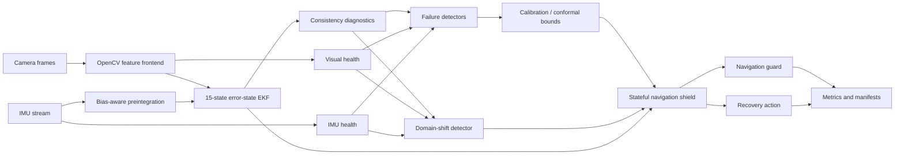

# SHIELD-VIO

<p align="center">
  <strong>Estimator introspection, calibrated failure prediction, and protective navigation for visual–inertial autonomy</strong>
</p>

<p align="center">
  A reproducible research framework for detecting when visual–inertial state estimation is becoming unreliable,<br/>
  quantifying that risk, and shielding downstream navigation before localization failure becomes safety critical.
</p>

<p align="center">
  <a href="https://github.com/panagiotagrosdouli/SHIELD-VIO/actions"></a>
  
  
  
  
</p>

<p align="center">
  
</p>

> **Research question**  
> How can a visual–inertial estimator recognize that its state estimate is becoming unreliable early enough to protect downstream navigation, trigger recovery, and maintain meaningful confidence under sensor degradation and domain shift?

## At a glance

| Layer | Current capability | Evidence level |
|---|---|---|
| Visual frontend | Shi–Tomasi + pyramidal Lucas–Kanade tracking | Research Prototype |
| Inertial backend | Bias-aware IMU preintegration | Analytical Unit Validation |
| Estimation | 15-state error-state EKF | Numerical Invariant Validation |
| Failure prediction | Rule, logistic, calibration metrics, conformal bounds | Experimental |
| Shift awareness | Rolling four-state domain-shift detector | Experimental |
| Navigation protection | Stateful shield, speed limiting, hold, halt, relocalization request | Closed-loop Unit Validation |
| Evaluation | Seeded degradations, failure labels, multi-seed statistics | Synthetic Validation |
| Public datasets | EuRoC, TUM-VI, generic adapters | Pending Dataset Execution |
| ROS 2 / hardware | Planned | Validation Required |

## Why SHIELD-VIO?

Trajectory accuracy alone is not enough for safety-oriented autonomy. A robot must also know:

- when its state estimate is no longer trustworthy;
- whether uncertainty is statistically consistent;
- whether the current sensor stream differs from the calibration domain;
- how likely a near-term localization failure is;
- and which protective or recovery action should be taken.

SHIELD-VIO treats estimator health as a first-class signal. Visual quality, IMU health, innovations, covariance, consistency diagnostics, failure scores, calibrated probabilities, conformal bounds, domain-shift states, shield actions, and recovery requests remain explicit and auditable.

<p align="center">
  
</p>

## Research architecture



The complete feature frontend, preintegration module, and ESKF are research components rather than a production-quality end-to-end VIO replacement.

## Scientific formulation

The nominal IMU-centric state is

```math
x = \{p_{WI}, v_{WI}, q_{WI}, b_a, b_g\},
```

with a 15-dimensional local error state

```math
\delta x = [\delta p, \delta v, \delta \theta, \delta b_a, \delta b_g]^T.
```

For innovation `ν` and innovation covariance `S`, consistency is monitored through

```math
\mathrm{NIS} = \nu^T S^{-1}\nu.
```

When ground truth is available,

```math
\mathrm{NEES} = e^T P^{-1}e.
```

An uncalibrated diagnostic score is never treated as a probability.

## Implemented research components

### Real visual feature tracking

- Shi–Tomasi corner detection;
- pyramidal Lucas–Kanade optical flow;
- persistent track identifiers;
- forward–backward rejection;
- feature replenishment and exclusion masks;
- track age, survival, outlier ratio, blur, brightness, and feature-count diagnostics.

<p align="center"></p>

### IMU preintegration and ESKF

- delta position, velocity, and rotation;
- covariance propagation;
- accelerometer and gyroscope bias handling;
- first-order bias Jacobians;
- 15-state propagation;
- Joseph-form visual updates;
- quaternion normalization;
- covariance symmetry and PSD repair;
- external-pose reset for recovery studies.

<p align="center"></p>

### Controlled degradation

Visual degradations include darkness, overexposure, additive noise, contrast reduction, feature dropout, occlusion, and frame dropout. IMU degradations include noise, bias drift, scale-factor error, saturation, axis failure, and packet loss. Every transformation is deterministic under a fixed seed and emits explicit metadata.

### Failure prediction, calibration, and shift awareness

Implemented baselines include:

- transparent multi-signal rules;
- a lightweight logistic detector;
- Brier score, NLL, ECE, and maximum calibration error;
- split-conformal scalar bounds;
- rolling `IN_DISTRIBUTION`, `POSSIBLE_SHIFT`, `CONFIRMED_SHIFT`, and `SEVERE_SHIFT` states.

<p align="center"></p>

<p align="center"></p>

### Closed-loop shielding and recovery

The stateful shield supports:

`NORMAL → WARNING → SLOW_DOWN → HOLD_POSITION → RELOCALIZE_REQUESTED → HALT → EMERGENCY_STOP`

It includes hysteresis, minimum dwell behavior, stale-sensor handling, emergency override, speed scaling, and recovery-action selection.

<p align="center"></p>

<p align="center"></p>

## Executable evidence

The README distinguishes explanatory SVGs from experimental evidence. The pinned evidence below comes from deterministic CI run `#86`, seed `7`, artifact `shield-vio-readme-evidence`.

<p align="center"> </p>

These figures are **Synthetic Validation only**. They do not imply public-dataset, ROS 2, simulator, hardware, production-VIO, or formal-safety validation.

## Failure definitions and statistics

Failure labels are derived from observable estimator or navigation behavior, including excessive position error, RPE, covariance instability, innovation inconsistency, tracking loss, bias instability, and unsafe clearance. Injected degradation is not automatically treated as estimator failure.

Aggregate reporting supports mean, standard deviation, median, quartiles, IQR, extrema, approximate 95% confidence intervals, precision, recall, F1, false-alarm rate, and missed-failure rate.

## Installation

```bash
git clone https://github.com/panagiotagrosdouli/SHIELD-VIO.git
cd SHIELD-VIO
python -m venv .venv
source .venv/bin/activate
python -m pip install --upgrade pip
python -m pip install -e '.[dev]'
```

Windows PowerShell:

```powershell
.venv\Scripts\Activate.ps1
```

## Reproduce

Run the complete deterministic synthetic pipeline:

```bash
python scripts/run_all.py
```

Run static checks and tests:

```bash
ruff check shield_vio scripts tests
black --check .
pytest -q
```

Generate README evidence panels from actual run artifacts:

```bash
python scripts/run_synthetic_demo.py --out results/synthetic_demo --seed 7
python scripts/generate_readme_evidence.py \
  --results results/synthetic_demo \
  --output assets/readme/evidence
```

Run repeated scenarios:

```bash
python scripts/run_scenario_suite.py --num-seeds 20 --output results/scenario_suite
```

Docker:

```bash
docker build -t shield-vio .
docker run --rm -v "$(pwd)/results:/app/results" shield-vio python scripts/run_all.py
```

## Public-dataset adapters

Local-layout adapters exist for EuRoC MAV, TUM-VI, and generic timestamped camera/IMU folders. They are validated with mocked filesystem fixtures. No public-sequence metric is claimed until actual dataset execution is completed.

## Evaluation protocol

A rigorous experiment should separate training, calibration, test, and shifted-test sequences. Detector comparisons should use identical seeds and failure definitions. Relevant metrics include:

- precision, recall, F1, AUROC, and AUPRC;
- Brier score, NLL, ECE, and reliability diagrams;
- warning lead time;
- conformal empirical coverage and interval width;
- unsafe navigation events;
- mission completion and recovery success;
- runtime and computational latency.

## Research roadmap

<p align="center"></p>

Near-term priorities:

1. connect feature observations and preintegrated IMU increments into a complete executable ESKF sequence;
2. run calibrated detector comparisons on identical seeds;
3. execute EuRoC and TUM-VI sequences;
4. add reliability, lead-time, ablation, and sensitivity studies;
5. strengthen recovery and active-perception actions;
6. add ROS 2 bag replay and simulator validation;
7. proceed to hardware only after dataset and simulation evidence are stable.

## Limitations

- The integrated production-quality VIO backend is not complete.
- The frontend, preintegration, and ESKF are research prototypes.
- Real public-dataset execution remains pending.
- The logistic detector has not been benchmarked on real failure data.
- Conformal coverage depends on calibration assumptions and may fail under severe non-exchangeable shift.
- Robust relocalization, map management, loop closure, active perception, ROS 2, simulator, and hardware execution remain incomplete.
- The navigation shield is supervisory research logic, not a formally verified controller.
- No production, hardware-safety, state-of-the-art, or formal-guarantee claim is made.

## Reproducibility rules

Every reported result should record configuration, seed, estimator backend, detector method, sequence, dependency versions, Git commit, command, runtime, metrics, and artifact paths. Synthetic values must never be presented as real-world benchmark results. Oracle degradation labels must remain separate from deployable detector inputs.

## Citation

```bibtex
@misc{grosdouli2026shieldvio,
  title  = {SHIELD-VIO: Estimator Introspection, Calibrated Failure Prediction, and Protective Navigation for Visual--Inertial Autonomy},
  author = {Grosdouli, Panagiota},
  year   = {2026},
  note   = {Open-source research prototype; synthetic validation and public-dataset adapters},
  url    = {https://github.com/panagiotagrosdouli/SHIELD-VIO}
}
```

## License

Released under the MIT License.
