# SHIELD-VIO

<p align="center">
  <strong>Estimator introspection, calibrated failure prediction, and protective navigation for visual–inertial autonomy</strong>
</p>

<p align="center">
  A reproducible research framework for detecting when visual–inertial state estimation is becoming unreliable,<br/>
  quantifying that risk, and shielding downstream navigation before localization failure becomes safety critical.
</p>

<p align="center">
  <a href="https://github.com/panagiotagrosdouli/SHIELD-VIO/actions"></a>
  
  
  
  
</p>

<p align="center">
  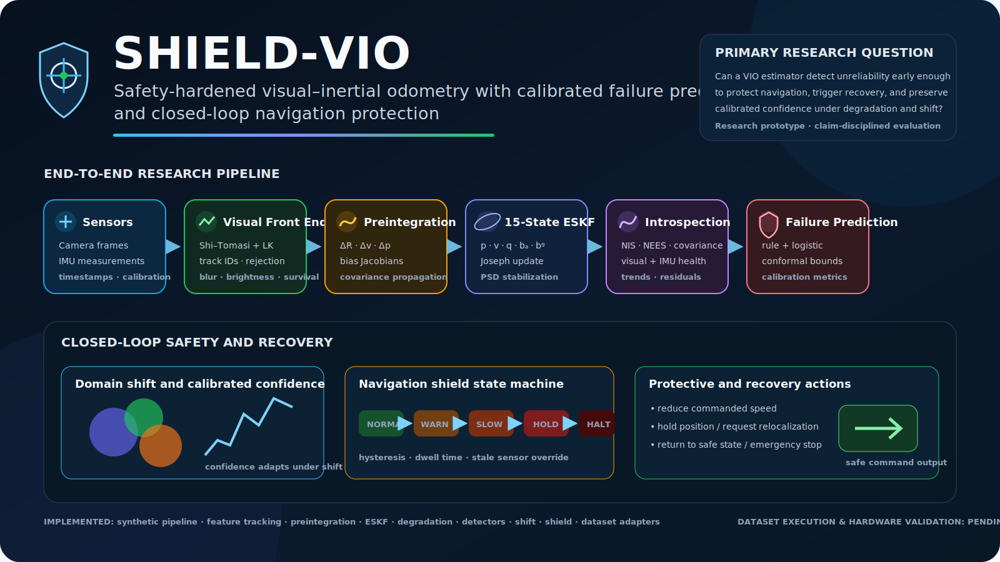
</p>

> **Research question**  
> How can a visual–inertial estimator recognize that its state estimate is becoming unreliable early enough to protect downstream navigation, trigger recovery, and maintain meaningful confidence under sensor degradation and domain shift?

## At a glance

| Layer | Current capability | Evidence level |
|---|---|---|
| Visual frontend | Shi–Tomasi + pyramidal Lucas–Kanade tracking | Research prototype |
| Inertial backend | Bias-aware IMU preintegration | Analytical unit validation |
| Estimation | 15-state error-state EKF | Numerical invariant validation |
| Failure prediction | Rules, logistic baseline, calibration metrics, conformal bounds | Experimental |
| Shift awareness | Rolling four-state domain-shift detector | Experimental |
| Navigation protection | Stateful shield, speed limiting, hold, halt, relocalization request | Closed-loop unit validation |
| Evaluation | Seeded degradations, failure labels, multi-seed statistics | Synthetic validation |
| Public datasets | EuRoC, TUM-VI, generic adapters | Pending dataset execution |
| ROS 2 / hardware | Planned | Validation required |

## Why SHIELD-VIO?

Trajectory accuracy alone is not enough for safety-oriented autonomy. A robot must also know when its estimate is no longer trustworthy, whether its uncertainty is statistically consistent, whether the sensor stream has shifted away from the calibration domain, and which protective action should follow.

SHIELD-VIO treats estimator health as a first-class signal. Visual quality, IMU health, innovations, covariance, consistency diagnostics, failure scores, calibrated probabilities, conformal bounds, domain-shift states, shield actions, and recovery requests remain explicit and auditable.

<p align="center">
  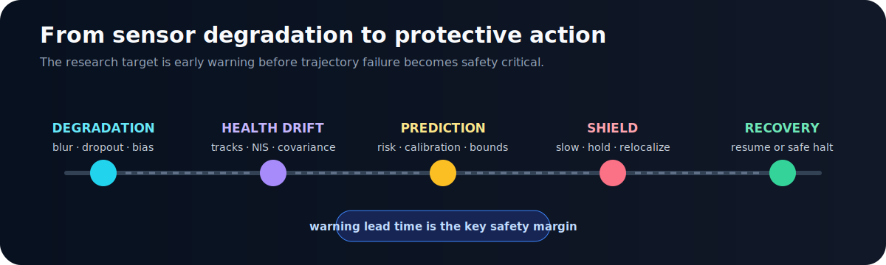
</p>

## Research architecture

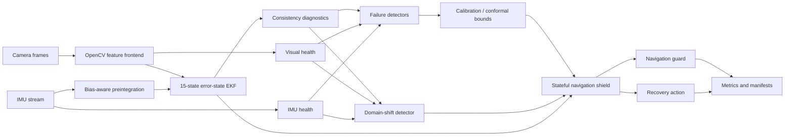

The feature frontend, preintegration module, and ESKF are research components rather than a production-quality end-to-end VIO replacement.

## Implemented research components

### Visual feature tracking

- Shi–Tomasi corner detection;
- pyramidal Lucas–Kanade optical flow;
- persistent track identifiers;
- forward–backward rejection;
- feature replenishment and exclusion masks;
- track age, survival, outlier ratio, blur, brightness, and feature-count diagnostics.

<p align="center">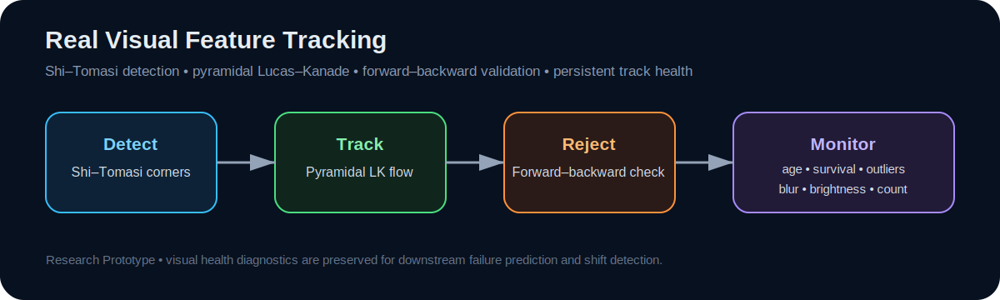</p>

### IMU preintegration and ESKF

- delta position, velocity, and rotation;
- covariance propagation and bias Jacobians;
- 15-state error propagation;
- Joseph-form visual updates;
- quaternion normalization;
- covariance symmetry and PSD repair;
- external-pose reset for recovery studies.

<p align="center">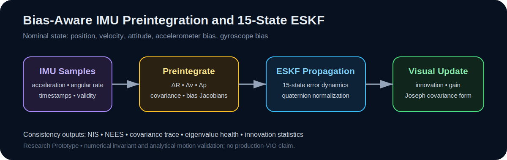</p>

### Failure prediction and shift awareness

The repository includes interpretable multi-signal rules, a lightweight logistic detector, Brier score, NLL, ECE, maximum calibration error, split-conformal scalar bounds, and rolling domain-shift states.

<p align="center">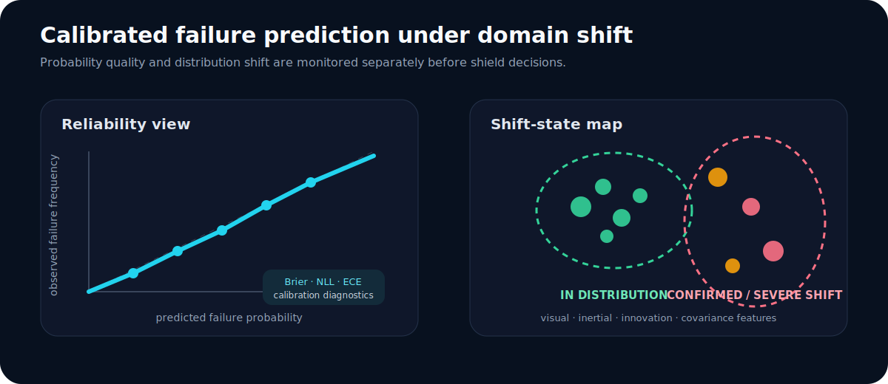</p>
<p align="center">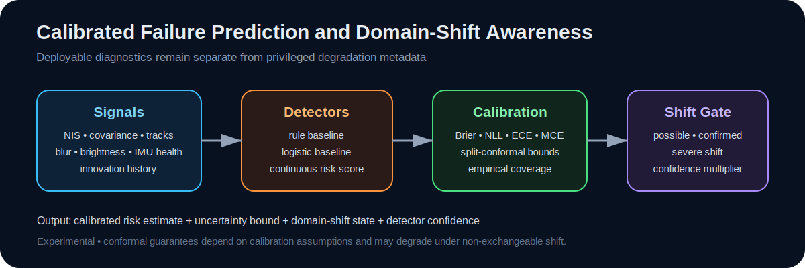</p>

### Closed-loop shielding and recovery

`NORMAL → WARNING → SLOW_DOWN → HOLD_POSITION → RELOCALIZE_REQUESTED → HALT → EMERGENCY_STOP`

The shield includes hysteresis, minimum dwell behavior, stale-sensor handling, emergency override, speed scaling, and recovery-action selection.

<p align="center">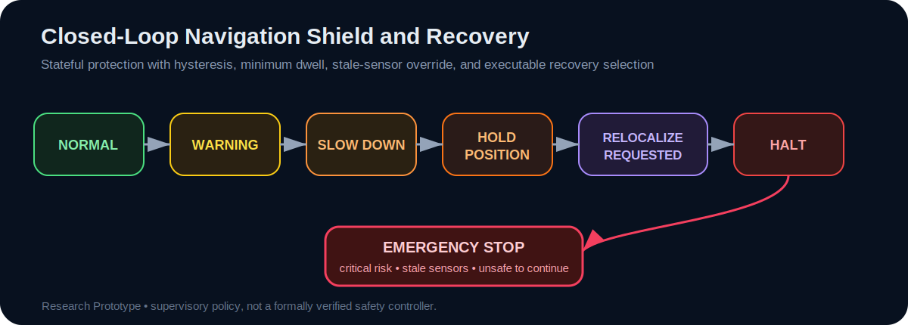</p>
<p align="center"></p>

## Executable evidence

The panels below come from a deterministic synthetic CI run and are kept separate from explanatory graphics.

<p align="center">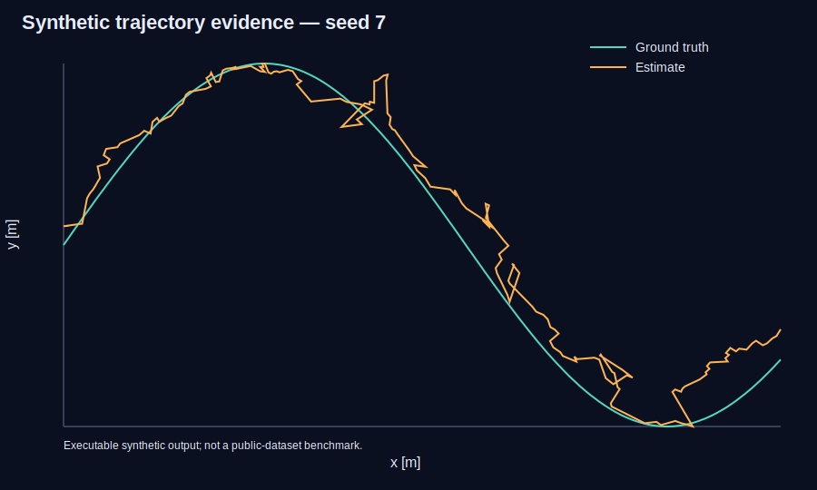 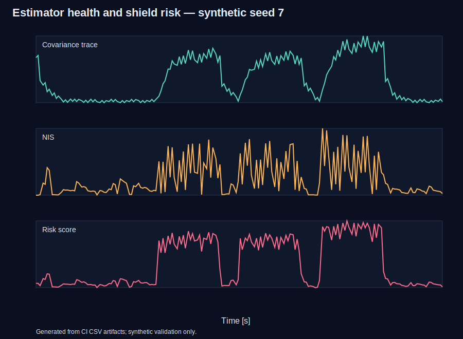</p>

These figures are **synthetic validation only**. They do not imply public-dataset, ROS 2, simulator, hardware, production-VIO, calibrated real-world, or formal-safety validation.

## Installation and reproduction

```bash
git clone https://github.com/panagiotagrosdouli/SHIELD-VIO.git
cd SHIELD-VIO
python -m venv .venv
source .venv/bin/activate
python -m pip install --upgrade pip
python -m pip install -e '.[dev]'
python scripts/run_all.py
```

Static checks and tests:

```bash
ruff check shield_vio scripts tests
black --check .
pytest -q
```

Generate evidence panels:

```bash
python scripts/run_synthetic_demo.py --out results/synthetic_demo --seed 7
python scripts/generate_readme_evidence.py \
  --results results/synthetic_demo \
  --output assets/readme/evidence
```

Run repeated scenarios:

```bash
python scripts/run_scenario_suite.py --num-seeds 20 --output results/scenario_suite
```

Docker:

```bash
docker build -t shield-vio .
docker run --rm -v "$(pwd)/results:/app/results" shield-vio python scripts/run_all.py
```

## Evaluation protocol

Training, calibration, test, and shifted-test sequences should remain separate. Detector comparisons should use identical seeds and failure definitions. Relevant metrics include precision, recall, F1, AUROC, AUPRC, Brier score, NLL, ECE, warning lead time, conformal coverage, unsafe navigation events, recovery success, runtime, and computational latency.

Failure labels must be derived from observable estimator or navigation behavior. Injected degradation must not automatically be treated as estimator failure.

## Public-dataset adapters

Local-layout adapters exist for EuRoC MAV, TUM-VI, and generic timestamped camera/IMU folders. They are validated with mocked filesystem fixtures. No public-sequence metric is claimed until actual dataset execution is completed.

## Research roadmap

<p align="center">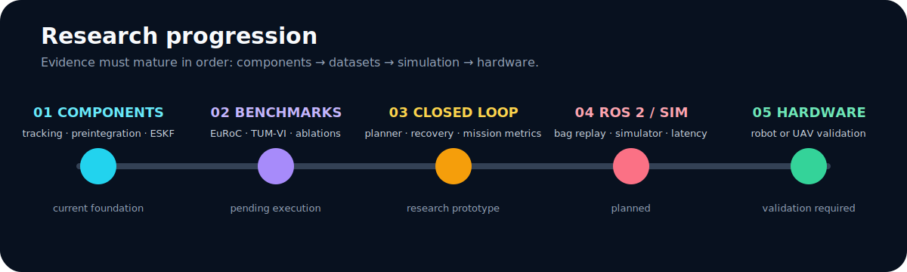</p>

1. Connect feature observations and preintegrated IMU increments into a complete executable ESKF sequence.
2. Run calibrated detector comparisons on identical seeds.
3. Execute EuRoC and TUM-VI sequences.
4. Add reliability, lead-time, ablation, and sensitivity studies.
5. Strengthen recovery and active-perception actions.
6. Add ROS 2 bag replay and simulator validation.
7. Proceed to hardware only after dataset and simulation evidence are stable.

## Limitations and claim boundary

- The integrated production-quality VIO backend is not complete.
- The frontend, preintegration, and ESKF are research prototypes.
- Real public-dataset execution remains pending.
- The logistic detector has not been benchmarked on real failure data.
- Conformal coverage may fail under severe non-exchangeable shift.
- Robust relocalization, map management, loop closure, active perception, ROS 2, simulator, and hardware execution remain incomplete.
- The navigation shield is supervisory research logic, not a formally verified controller.
- No production, hardware-safety, state-of-the-art, or formal-guarantee claim is made.

Every reported result should record configuration, seed, estimator backend, detector method, sequence, dependency versions, Git commit, command, runtime, metrics, and artifact paths.

## Citation

```bibtex
@misc{grosdouli2026shieldvio,
  title  = {SHIELD-VIO: Estimator Introspection, Calibrated Failure Prediction, and Protective Navigation for Visual--Inertial Autonomy},
  author = {Grosdouli, Panagiota},
  year   = {2026},
  note   = {Open-source research prototype; synthetic validation and public-dataset adapters},
  url    = {https://github.com/panagiotagrosdouli/SHIELD-VIO}
}
```

## License

Released under the MIT License.
