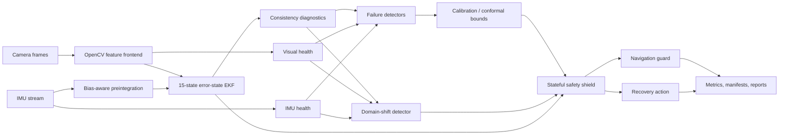

# SHIELD-VIO

<p align="center">
  <strong>Estimator introspection, calibrated failure prediction, and protective navigation for visual–inertial autonomy</strong>
</p>

<p align="center">
  A reproducible research framework for detecting when visual–inertial state estimation is becoming unreliable,<br/>
  quantifying that risk, and shielding downstream navigation before localization failure becomes safety critical.
</p>

<p align="center">
  <a href="https://github.com/panagiotagrosdouli/SHIELD-VIO/actions"></a>
  
  
  
  
</p>

<p align="center">
  
</p>

<p align="center"><em>Generated project overview. Component status and validation boundaries match the repository evidence described below.</em></p>

> **Research question**  
> How can a visual–inertial estimator recognize that its state estimate is becoming unreliable early enough to protect downstream navigation, trigger recovery, and maintain meaningful confidence under sensor degradation and domain shift?

---

## Why SHIELD-VIO?

Visual–inertial odometry is usually judged by trajectory accuracy. In safety-oriented autonomy, that is not enough. A robot also needs to know:

- when its estimate is no longer trustworthy;
- whether its uncertainty is statistically consistent;
- whether the current sensor stream differs from the calibration domain;
- how likely a near-term localization failure is;
- and which protective or recovery action should be taken.

SHIELD-VIO treats estimator health as a first-class signal. It preserves source-level visual, inertial, innovation, covariance, and consistency diagnostics; converts them into interpretable failure predictions; detects distribution shift; and feeds the result into a stateful navigation shield.

This repository is a **research prototype**, not a production VIO system, certified safety controller, or state-of-the-art benchmark implementation.

<p align="center">
  
</p>

<p align="center"><em>Existing deterministic synthetic demonstration. It is not a real-dataset benchmark.</em></p>

---

## Research scope

SHIELD-VIO currently studies six connected problems:

1. **Visual–inertial estimation** — real sparse visual tracking, IMU preintegration, and a 15-state error-state EKF prototype.
2. **Estimator introspection** — NIS, NEES, covariance health, innovation behavior, visual quality, and inertial-health indicators.
3. **Failure prediction** — transparent rules, a lightweight logistic baseline, calibration metrics, and split-conformal risk bounds.
4. **Domain-shift awareness** — rolling detection of visual, inertial, innovation, and covariance distribution changes.
5. **Closed-loop protection** — warning, slowdown, hold, relocalization request, halt, and emergency-stop actions.
6. **Reproducible evaluation** — deterministic degradation injection, explicit failure labels, multi-seed experiments, aggregate statistics, and public-dataset adapters.

---

## System architecture



The preserved synthetic pipeline remains available alongside the newer modular research components. The complete feature frontend, preintegration module, and ESKF are currently validated as research components through unit and invariant tests; they are not yet claimed as a production-quality end-to-end VIO backend.

---

## Scientific formulation

The nominal IMU-centric state is

```math
x = \{p_{WI}, v_{WI}, q_{WI}, b_a, b_g\},
```

with a 15-dimensional local error state

```math
\delta x =
[\delta p,\delta v,\delta\theta,\delta b_a,\delta b_g]^T.
```

For innovation `ν` and innovation covariance `S`, the normalized innovation squared is

```math
\mathrm{NIS} = \nu^T S^{-1}\nu.
```

When ground truth is available, normalized estimation error squared is used to assess consistency:

```math
\mathrm{NEES} = e^T P^{-1} e.
```

SHIELD-VIO keeps these quantities separate from visual quality, covariance growth, inertial health, failure scores, calibrated probabilities, and conformal bounds. An uncalibrated diagnostic score is never treated as a probability.

---

## Implemented research components

### Real visual feature frontend

The OpenCV frontend supports:

- Shi–Tomasi corner detection;
- pyramidal Lucas–Kanade optical flow;
- persistent feature-track identifiers;
- forward–backward consistency rejection;
- feature replenishment and exclusion-mask balancing;
- track age and survival rate;
- outlier-ratio diagnostics;
- blur estimation using Laplacian variance;
- brightness and feature-count monitoring.

Classification: **Research Prototype**.

### IMU preintegration

The preintegration module maintains:

- delta position;
- delta velocity;
- delta rotation;
- covariance propagation;
- accelerometer and gyroscope bias handling;
- first-order bias Jacobians;
- gravity and variable sampling intervals.

Analytically simple motion cases are covered by numerical tests.

Classification: **Research Prototype / Analytical Unit Validation**.

### Error-state EKF

The ESKF prototype implements:

- the state `{p, v, q, b_a, b_g}`;
- 15-dimensional covariance propagation;
- IMU-driven propagation;
- visual position updates;
- Joseph-form covariance updates;
- quaternion normalization;
- covariance symmetrization and PSD repair;
- external-pose reset for recovery research.

Classification: **Research Prototype / Numerical Invariant Validation**.

### Controlled degradation engine

Visual degradations include darkness, overexposure, additive noise, contrast reduction, feature dropout, occlusion, and frame dropout.

IMU degradations include additive noise, bias drift, scale-factor error, saturation, axis failure, and packet dropout.

Each degradation is deterministic under a fixed seed and produces explicit metadata rather than silently changing the stream.

Classification: **Implemented / Synthetic Validation**.

### Failure detection and calibration

Implemented baselines include:

- transparent multi-signal rule detector;
- dependency-light logistic failure detector;
- split-conformal scalar risk bounds;
- Brier score;
- negative log likelihood;
- expected calibration error;
- maximum calibration error.

The conformal implementation exposes its finite-sample and exchangeability assumptions. It does not imply unconditional safety guarantees under arbitrary domain shift.

Classification: **Research Prototype / Experimental**.

### Domain-shift detection

A rolling transparent detector maps sustained deviations into:

- `IN_DISTRIBUTION`;
- `POSSIBLE_SHIFT`;
- `CONFIRMED_SHIFT`;
- `SEVERE_SHIFT`.

The detected state modifies detector confidence and can increase shield conservatism.

Classification: **Experimental**.

### Closed-loop navigation shield

The stateful shield supports:

- `NORMAL`;
- `WARNING`;
- `SLOW_DOWN`;
- `HOLD_POSITION`;
- `RELOCALIZE_REQUESTED`;
- `HALT`;
- `EMERGENCY_STOP`.

It includes hysteresis, minimum dwell behavior, stale-sensor handling, emergency override, speed scaling, and executable recovery-action selection.

Classification: **Research Prototype / Closed-loop Unit Validation**.

### Failure labels and statistics

Failure labels are derived from observable estimator or navigation behavior, including:

- excessive position error;
- excessive relative-pose error;
- covariance instability;
- innovation inconsistency;
- visual tracking loss;
- bias instability;
- unsafe downstream clearance.

Injected degradation is not automatically equated with estimator failure.

Aggregate reporting supports run counts, failures, mean, standard deviation, median, quartiles, IQR, extrema, approximate 95% confidence intervals, precision, recall, F1, false-alarm rate, and missed-failure rate.

Classification: **Implemented / Synthetic Validation**.

### Public-dataset adapters

Adapters validate local layouts for:

- EuRoC MAV;
- TUM-VI;
- generic timestamped camera and IMU folders.

They are tested against mocked filesystem fixtures. No public sequence is bundled and no real-dataset metric is reported by this README.

Classification: **Dataset Adapter Implemented / Pending Dataset Execution**.

---

## Evidence matrix

| Subsystem | Status | Current evidence |
|---|---|---|
| Deterministic synthetic estimator pipeline | Implemented | CI-tested scripts and generated CSV/media pipeline |
| ATE, RPE, NIS, NEES, covariance and visual-quality logging | Implemented | Synthetic validation |
| OpenCV sparse feature tracking | Research Prototype | Unit tests and deterministic diagnostics |
| IMU preintegration | Research Prototype | Analytical motion tests |
| 15-state error-state EKF | Research Prototype | Quaternion/covariance invariant tests |
| Controlled visual and IMU degradation | Implemented | Seeded synthetic tests |
| Rule-based failure detector | Implemented baseline | Unit tests |
| Logistic failure detector | Implemented baseline | Unit tests; no real-data benchmark |
| Calibration metrics | Implemented | Numerical tests |
| Split-conformal risk bounds | Experimental | Coverage tests on controlled arrays |
| Domain-shift detector | Experimental | Sustained-shift escalation tests |
| Navigation shield and recovery request | Research Prototype | Closed-loop policy tests |
| Multi-seed scenario runner | Implemented | Two-seed CI smoke test |
| EuRoC/TUM-VI adapters | Implemented adapters | Mocked-layout validation only |
| Real public-dataset results | Pending Dataset Execution | No metrics claimed |
| ROS 2 execution | Planned | Not validated |
| Hardware safety | Hardware Validation Required | Not claimed |
| Formal safety guarantees | Not claimed | Outside current evidence |

---

## Installation

```bash
git clone https://github.com/panagiotagrosdouli/SHIELD-VIO.git
cd SHIELD-VIO
python -m venv .venv
source .venv/bin/activate
python -m pip install --upgrade pip
python -m pip install -e '.[dev]'
```

On Windows PowerShell, activate the environment with:

```powershell
.venv\Scripts\Activate.ps1
```

---

## Reproduce the validated synthetic pipeline

Run the complete preserved demonstration:

```bash
python scripts/run_all.py
```

Run the tests and static checks:

```bash
ruff check shield_vio scripts tests
black --check .
pytest -q
```

Run individual pipeline stages:

```bash
python scripts/run_synthetic_demo.py --out results/synthetic_demo --seed 7
python scripts/evaluate_experiment.py --results results/synthetic_demo
python scripts/generate_figures.py --results results/synthetic_demo
python scripts/make_demo_gif.py --results results/synthetic_demo
```

Run repeated synthetic experiments:

```bash
python scripts/run_scenario_suite.py --num-seeds 20 --output results/scenario_suite
```

The runner isolates each seed, continues after individual failures, records the exact seed list, and writes an aggregate JSON summary.

---

## Docker

```bash
docker build -t shield-vio .
docker run --rm \
  -v "$(pwd)/results:/app/results" \
  shield-vio \
  python scripts/run_all.py
```

Docker support belongs to the preserved synthetic pipeline. Hardware, GPU, ROS 2, and public-dataset execution are not implied by this command.

---

## Repository structure

```text
shield_vio/
├── core/                 typed state and measurement records
├── features/             OpenCV feature tracking and visual diagnostics
├── preintegration/       bias-aware IMU preintegration
├── estimation/           estimator interfaces and error-state EKF
├── consistency/          NIS/NEES and consistency diagnostics
├── uncertainty/          covariance and uncertainty summaries
├── failure_detection/    rule, logistic and conformal methods
├── calibration_metrics/  probabilistic calibration metrics
├── domain_shift/         rolling shift-state detection
├── shield/               stateful protective policy
├── navigation/           downstream command guarding
├── recovery/             recovery-action representations and selection
├── datasets/             EuRoC, TUM-VI and generic adapters
├── simulation/           synthetic scenario and degradation injection
└── evaluation/           failure labels, metrics and aggregate statistics

scripts/
├── run_all.py
├── run_synthetic_demo.py
├── run_scenario_suite.py
├── evaluate_experiment.py
├── generate_figures.py
└── make_demo_gif.py

docs/
├── FAILURE_DEFINITIONS.md
└── RESEARCH_IMPLEMENTATION_STATUS.md
```

---

## Generated evidence

The existing synthetic pipeline produces artifacts such as:

```text
results/synthetic_demo/ground_truth.csv
results/synthetic_demo/estimated_trajectory.csv
results/synthetic_demo/uncertainty.csv
results/synthetic_demo/visual_quality.csv
results/synthetic_demo/risk_score.csv
results/synthetic_demo/shield_events.csv
results/metrics/summary.json
results/metrics/metrics.csv
results/figures/*.png
assets/gifs/demo.gif
assets/videos/demo.mp4
```

The multi-seed runner additionally produces isolated run directories and:

```text
results/scenario_suite/suite_summary.json
```

All current generated numerical evidence is classified as **Synthetic Validation** unless explicitly stated otherwise.

---

## Evaluation protocol

A rigorous SHIELD-VIO experiment should separate:

1. **Training sequences** — used only to fit learned detector parameters.
2. **Calibration sequences** — used for probability or conformal calibration.
3. **Test sequences** — never used during fitting or calibration.
4. **Shifted test sequences** — containing unseen degradation families or changed sensor statistics.

Detector methods should be compared on identical seeds and failure definitions. Relevant metrics include:

- precision, recall, F1;
- false-alarm and missed-failure rates;
- AUROC and AUPRC when score distributions are available;
- Brier score, NLL, ECE and reliability diagrams;
- warning lead time;
- conformal empirical coverage and interval width;
- unsafe navigation events;
- mission completion and recovery success;
- runtime and computational latency.

The current repository provides several of these primitives, but it does not yet claim complete hypothesis-level evaluation across real public datasets.

---

## Scientific hypotheses

The project is designed to evaluate the following hypotheses:

- **H1:** consistency diagnostics detect degradation earlier than trajectory-error thresholds alone;
- **H2:** multi-signal detectors outperform any single diagnostic source;
- **H3:** calibrated failure probabilities support more reliable shield decisions than uncalibrated scores;
- **H4:** shielding reduces unsafe downstream actions under degraded localization;
- **H5:** recovery-aware protection improves mission outcomes over halt-only protection;
- **H6:** conformal or quantile-based bounds degrade more gracefully under shift than fixed covariance thresholds;
- **H7:** failure detectors lose reliability on unseen degradation modes unless domain shift is detected.

These are research hypotheses, not confirmed conclusions. Confirmation requires controlled multi-seed and public-dataset experiments with appropriate train/calibration/test separation.

---

## Limitations

- The integrated production-quality visual–inertial backend is not complete.
- The feature frontend, preintegration module, and ESKF are research prototypes rather than a validated replacement for OpenVINS, VINS-Fusion, or ORB-SLAM3.
- The logistic detector has not been benchmarked on real visual–inertial failure data.
- Conformal coverage depends on calibration assumptions and may fail under severe non-exchangeable shift.
- Dataset adapters are fixture-validated; public-dataset execution remains pending.
- Robust relocalization, map management, loop closure, active perception, and external-VIO integration remain incomplete.
- ROS 2, simulator, and hardware execution are not validated.
- The navigation shield is supervisory research logic, not a formally verified controller.
- No production, hardware-safety, state-of-the-art, or formal-guarantee claim is made.

---

## Research roadmap

Near-term priorities are:

1. connect real feature observations and preintegrated IMU increments into a complete executable ESKF sequence;
2. add full scenario configuration files and identical-seed detector comparisons;
3. execute reliability, warning-lead-time, conformal-coverage, ablation, and sensitivity studies;
4. run EuRoC and TUM-VI sequences without fabricating missing covariance or failure labels;
5. add external VIO trajectory adapters and covariance-aware evaluation where available;
6. strengthen recovery policies and active-perception actions;
7. add ROS 2 bag replay and simulator validation;
8. proceed to hardware only after simulation and dataset evidence are stable.

---

## Reproducibility and claim discipline

Every result should record:

- configuration;
- seed;
- estimator backend;
- detector method;
- data sequence;
- software and dependency versions;
- Git commit;
- command;
- runtime;
- metric summary;
- artifact paths.

Synthetic values must never be presented as real-world benchmark results. Mocked dataset fixtures validate parsing logic only. Oracle degradation labels are privileged information and must be reported separately from deployable detectors.

---

## Contributing

Contributions are especially useful in:

- numerical validation of preintegration and ESKF Jacobians;
- public-dataset preparation and reproducible execution;
- calibrated and conformal failure prediction;
- domain-shift evaluation;
- recovery-aware navigation;
- ROS 2 integration;
- runtime profiling and ablation studies.

Please include focused tests, deterministic seeds, explicit units and coordinate frames, and an honest statement of the validation level.

---

## Citation

```bibtex
@misc{grosdouli2026shieldvio,
  title  = {SHIELD-VIO: Estimator Introspection, Calibrated Failure Prediction, and Protective Navigation for Visual--Inertial Autonomy},
  author = {Grosdouli, Panagiota},
  year   = {2026},
  note   = {Open-source research prototype; synthetic validation and public-dataset adapters},
  url    = {https://github.com/panagiotagrosdouli/SHIELD-VIO}
}
```

---

## License

Released under the MIT License.
